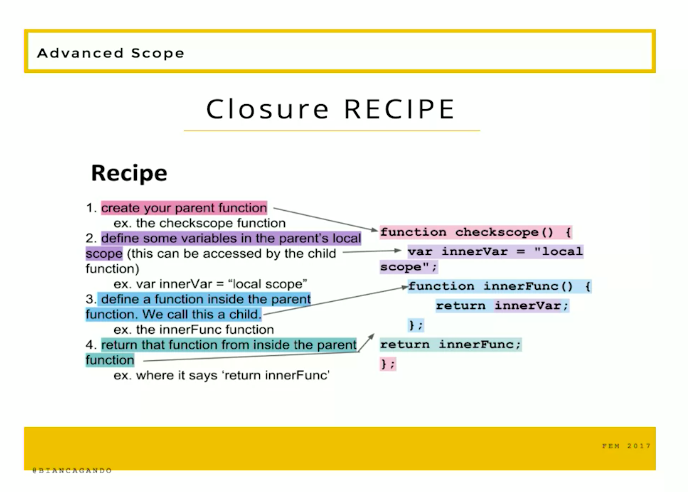

# Closure Defintion

A closure is an object containing two functions; a parent, and a child. Closures can return a function (child) which retains access to its parents function and scope, even after it has been executed.

# Closure Recipe

* Create your parent function
* Define some variables in the parents local scope (this can be accessed by the child function)
* Define a function inside the parent function. We call this a child
* Return that function (child) from inside the parent function

